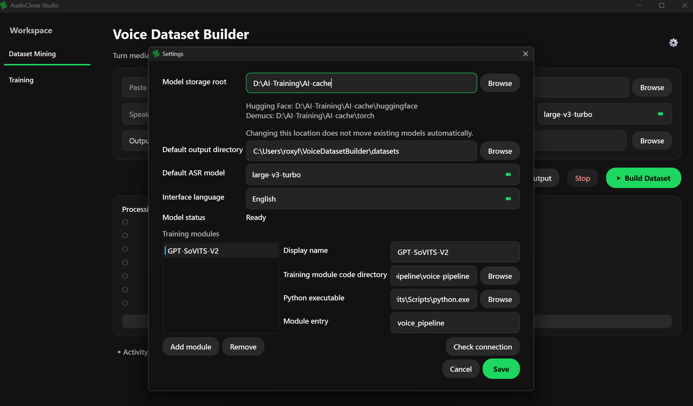
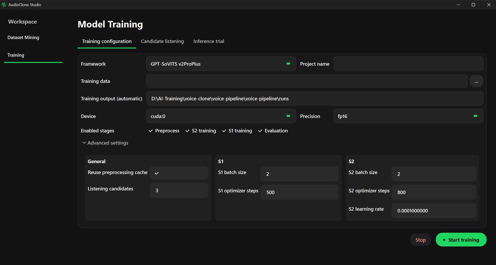
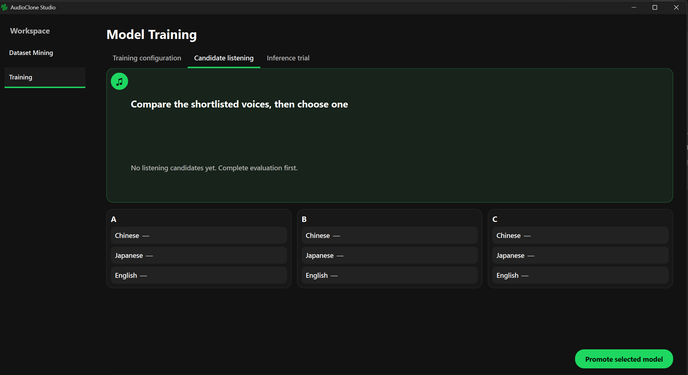
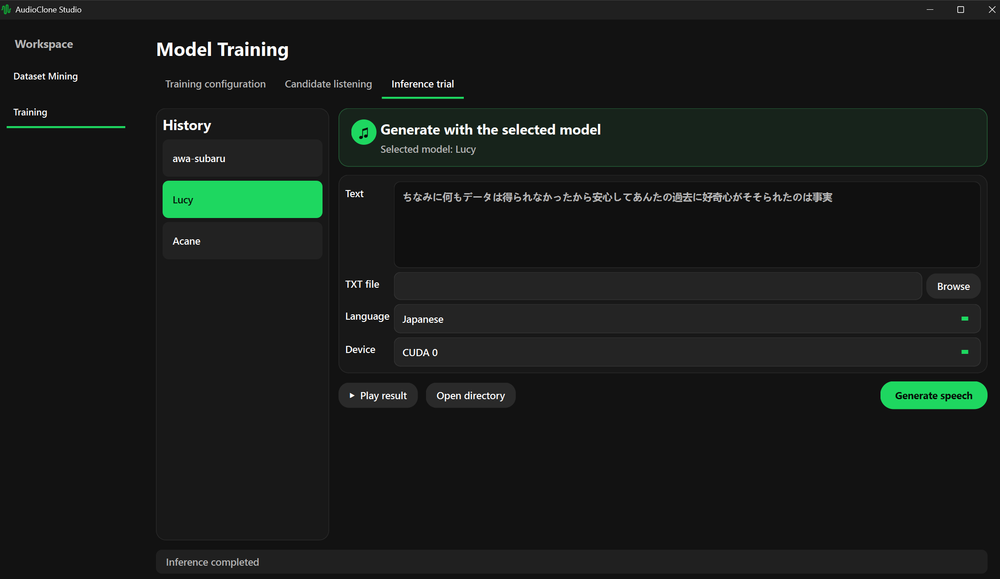

# AudioMiner / AudioClone Studio

AudioMiner / AudioClone Studio 是本地语音素材挖掘工具：输入本地音视频、YouTube 或 Bilibili 链接，自动完成人声分离、音频标准化、语音识别、切片和训练清单导出。

它有两种互不影响的使用方式：

- **AudioMiner 独立模式**：只安装本仓库，生成 `clips/`、`manifest.jsonl` 和 GPT-SoVITS `dataset.list`。
- **AudioClone Studio 完整模式**：额外连接独立的 `voice-pipeline`，在同一 GUI 中完成素材挖掘、预处理、S1/S2 训练、自动评测、A/B/C 试听、人工晋升和推理试验。

未配置训练模块时，原有素材挖掘 GUI、CLI 和缓存逻辑不会依赖或启动 voice-pipeline。

> 当前假设一个素材中主要只有一个目标说话人。工具可以去除背景音乐，但不负责多说话人分轨识别。请确保对素材及目标声音拥有合法使用权，禁止用于欺诈或冒充。

## 功能与边界

```text
本地音视频 / YouTube / Bilibili
  → Demucs 人声分离
  → FFmpeg 标准化
  → faster-whisper 多语言 ASR
  → 切片与质量过滤
  → clips + transcript + manifest.jsonl + dataset.list
  
配置训练模块后，将拓展模型训练，模型评测，推理适用能力
```

支持 Windows 10/11、Python 3.12、FFmpeg。NVIDIA GPU 推荐但不是必需；CPU 可以运行，但人声分离、ASR 和后续训练会明显慢很多。

## 一、安装 AudioMiner / AudioClone-Studio 

### 1. 获取源码

```powershell
git clone https://github.com/436and251/AudioClone-Studio.git AudioCloneStudio
Set-Location .\AudioCloneStudio
```

### 2. 安装 uv 和 FFmpeg

```powershell
winget install --id=astral-sh.uv -e
winget install --id=Gyan.FFmpeg -e
```

重新打开 PowerShell 后确认：

```powershell
uv --version
ffmpeg -version
ffprobe -version
```

### 3. 创建独立环境

```powershell
uv venv --python 3.12 venv
.\venv\Scripts\Activate.ps1
uv pip install -r requirements.txt
uv pip install -r requirements-gui.txt
```

如果 PowerShell 禁止执行激活脚本，可在当前窗口临时允许：

```powershell
Set-ExecutionPolicy -Scope Process Bypass
.\venv\Scripts\Activate.ps1
```

### 4. 启动 GUI

```powershell
python .\voice_dataset_builder.py
```

### 5. 首次启动与模型配置

第一次启动会先打开环境检查窗口，显示 NVIDIA/CUDA 加速、内存、FFmpeg 状态以及模型目录的剩余空间。此时只检查本机环境，**不会立即下载模型**。

在这个窗口中先选择一个长期使用、空间充足的“模型存储”目录，例如：

```text
D:\AI-cache\AudioCloneStudio\models
```

程序会在其下分别使用：

```text
D:\AI-cache\AudioCloneStudio\models\huggingface   # faster-whisper / Hugging Face
D:\AI-cache\AudioCloneStudio\models\torch         # Demucs / Torch Hub
```

点击“继续”后配置会保存。进入主界面后仍可通过右上角齿轮修改：

- 模型存储目录；
- 默认输出目录；
- 默认 ASR 模型；
- 界面语言；
- 可选的外部训练模块。

更改模型存储目录只会修改后续使用的位置，**不会自动移动旧目录中已经下载的模型**。

第一次真正开始素材处理时，如果所选 Whisper 模型尚未安装，GUI 会显示模型大小、存储位置和“下载并继续”确认框；Demucs 模型也会在人声分离阶段按需准备。下载中断后已完成的缓存会保留，重新执行任务即可继续，不需要手工删除缓存。

## 二、只使用AudioMiner功能

GUI 示例：

依次填写素材、输出目录、说话人、语言和 ASR 模型，然后开始处理。GUI 当前始终执行 Demucs；已经是干净人声、需要跳过分离时，请使用下方 CLI 的 `--skip-separation`。


CLI 示例：

```powershell
# 本地音频
python .\build_dataset.py 'D:\media\voice.wav' --speaker Acane --language ja --output 'D:\datasets\Acane'

# YouTube / Bilibili
python .\build_dataset.py 'https://www.youtube.com/watch?v=...' --speaker Acane --language ja --output 'D:\datasets\Acane'
python .\build_dataset.py 'https://www.bilibili.com/video/BV...' --speaker Acane --language ja --output 'D:\datasets\Acane'

# 已经是纯人声
python .\build_dataset.py 'D:\media\vocals.wav' --speaker Acane --language ja --skip-separation --output 'D:\datasets\Acane'
```

查看全部参数：

```powershell
python .\build_dataset.py -h
```

典型输出：

```text
D:\datasets\Acane\
├── clips\                 # 最终训练片段
├── transcripts\           # 每个来源的识别与切片详情
├── manifest.jsonl          # 通用数据清单
├── dataset.list            # GPT-SoVITS 四字段清单
└── .cache\                 # 中断恢复缓存
```

`dataset.list` 格式为：

```text
绝对音频路径|目标人|语言|文本
e.g. D:\AI-Training\voice-clone\train_data\lucy\clips\cv_e153d4bd_0001.wav|Lucy|ja|ふーん、あら、面白そうなものがある
```

任务成功后会自动删除体积较大的分离音频和整段标准化 WAV，保留来源/ASR 状态以便复用。失败或主动停止时保留已经完成的阶段；再次处理同一来源会尽量续接。

用户可以使用`--fresh` 强制重开，`--keep-temp` 仅用于调试并会明显增加磁盘占用。

## 三、接入训练框架

接入训练框架指导以我自己改造的gpt_sovits架构的训练框架作为范例，BS-Reformer或其他架构暂时无法支持。

### 1. 获取独立训练仓库

克隆voice-pipeline仓库，建议将两个仓库放在相邻目录，但不是强制要求：

```powershell
Set-Location ..
git clone https://github.com/436and251/voice-pipeline.git voice-pipeline
```

voice-pipeline 强依赖 PyTorch/CUDA，应使用**独立训练环境**。

```powershell
Set-Location .\voice-pipeline\voice-pipeline
uv venv --python 3.12 .venv-gpt-sovits
.\.venv-gpt-sovits\Scripts\Activate.ps1
uv pip install -e .
```

如果已经有包含兼容 Torch/CUDA 依赖的 Python 3.12 uv 环境，可直接注册源码而不重复解析重量级依赖：

```powershell
uv pip install --python 'D:\path\to\.venv-gpt-sovits\Scripts\python.exe' -e . --no-deps
```

### 2. 准备 GPT-SoVITS v2ProPlus 权重

用户可以从这里 [获取所有需要的模型](https://www.yuque.com/baicaigongchang1145haoyuangong/ib3g1e/dkxgpiy9zb96hob4#nVNhX)

然后按照如下目录层级配置（训练模块根目录下应存在）：

```text
models/pretrained/v2proplus/
├── bert/chinese-roberta-wwm-ext-large/
├── g2p/en/nltk_data/
├── g2pw/G2PWModel/
├── hubert/chinese-hubert-base/
├── langdetect/lid.176.bin
├── s1/s1v3.ckpt
├── s2/s2Gv2ProPlus.pth
├── s2/s2Dv2ProPlus.pth
└── speaker/pretrained_eres2netv2w24s4ep4.ckpt
```

验证训练模块和模型：

```powershell
$pipelinePython = 'D:\path\to\.venv-gpt-sovits\Scripts\python.exe'
& $pipelinePython -m voice_pipeline module describe --json
& $pipelinePython -m voice_pipeline models verify --project-root . --profile v2ProPlus
```

第一条应返回 `protocol_version: 2`，第二条必须全部通过后再训练。

### 3. 在 AudioClone-Studio 中连接

页面示例：



重新启动 AudioClone-Studio ，打开“设置 → 训练模块 → 添加”，填写：

```text
名称：GPT-SoVITS
训练模块代码目录：voice-pipeline 仓库内第二层 voice-pipeline 目录
Python：训练环境中的 python.exe
模块入口：voice_pipeline
```

点击“检查连接”。握手成功并保存后重启 GUI，窗口会显示为 **AudioClone Studio**，左侧出现“素材挖掘”和“训练”。AudioClone Studio 通过指定的 Python 启动训练子进程，不需要提前常驻运行服务。

## 四、完整工作流

1. 输入视频链接或者本地文件目录，完成数据构造。GPT-SoVITS使用其中的`dataset.list`格式数据。
2. 点击“继续训练”，跳转至训练页面；此时会自动绑定上一步获取的数据，当然也可以重新直接选择已有训练数据。
3. 填写目标人名称，选择 GPT-SoVITS v2ProPlus、设备和精度。训练输出固定在训练模块根目录，不会写回外部数据集目录。
4. 勾选预处理、S2、S1 和自动评测并开始。训练配置在运行中仍可编辑，但只对下一次任务生效。

5. 自动评测完成后，在“候选试听”比较 A/B/C 的中文、日文和英文试听；人工选择并晋升一个候选。

6. 晋升后在“推理试验”选择模型，输入文字或待推理.txt文件 （二选一）并生成 WAV。


训练、晋升和推理互斥，避免同时争用 GPU 和任务日志。

## 五、目录与自动清理

| 位置                                       | 内容 | 生命周期 |
|------------------------------------------|---|---|
| AudioMiner /AudioClone-Studio 设置中的默认输出目录 | clips、清单、转录、素材缓存 | 用户数据；成功后仅压缩大型中间文件 |
| AudioMiner /AudioClone-Studio 设置中的模型目录                     | Hugging Face/Whisper、Torch/Demucs 缓存 | 共享模型资源，不自动删除 |
| `voice-pipeline/models/pretrained/`      | 公共预训练权重 | 必需资源，不自动删除 |
| `voice-pipeline/models/<目标人>/`           | 已人工晋升的正式模型 | 永久保留，供历史与推理使用 |
| `voice-pipeline/runs/<目标人>/`             | 训练、评测、A/B/C 候选 | 晋升前保留；晋升后清理原始 checkpoint，但保留评测候选和试听 |
| `voice-pipeline/outputs/<目标人>/`          | 最终推理 WAV | 用户输出，不自动删除 |
| `voice-pipeline/jobs/<job_id>/`          | 协议快照、事件、失败诊断和临时推理请求 | 按下述规则自动清理 |

jobs 自动清理规则：

- 正在运行、意外中断或等待人工晋升的任务保留；
- 失败任务只保留 48 小时以内、每个目标人最新的一份；
- 晋升成功、推理完成、取消、过期失败和同一目标人的旧失败任务删除；
- 损坏、路径越界或状态无法可靠判断的目录不猜测删除，Activity 会显示汇总提示；
- Activity 只记录本次清理的汇总，不输出逐文件刷屏日志。

`runs/<目标人>` 保留三份 A/B/C 推理候选，所以一个已晋升项目通常约占“三份候选模型 + 一份正式模型”。这是人工审判机制要求的正式产物，不是缓存泄漏。

## 六、常见问题

### `ModuleNotFoundError: PySide6`
有可能是混用了虚拟环境，请确认启动 AudioClone-Studio 时使用的是本身的虚拟环境而不是voice-pipeline的环境或者别的虚拟环境。

检查是否安装了 GUI 依赖，若没有，进入正确的虚拟环境执行安装：

```powershell
.\venv\Scripts\Activate.ps1
uv pip install -r requirements-gui.txt
python .\voice_dataset_builder.py
```

### `voice-pipeline` 不是命令

激活环境只会选择 Python，不会自动注册当前源码。执行一次：

```powershell
uv pip install -e . --no-deps
```

也可以始终使用不依赖脚本注册的入口：

```powershell
python -m voice_pipeline --help
```

### 训练模块连接失败

分别检查训练代码目录、训练环境的 `python.exe`、模块入口 `voice_pipeline`，然后在训练模块目录执行：

```powershell
python -m voice_pipeline module describe --json
```

### 重启后找不到模型

只有晋升成功且 `models/<目标人>/` 六个 bundle 文件完整的模型才进入历史列表。候选不会作为正式模型显示；推理 WAV 位于 `outputs/<目标人>/gui/`。

### 磁盘占用增加

优先检查共享模型缓存、`runs/` 的三份候选、正式 `models/` 和素材输出目录。`jobs/` 会自动清理，但状态不明目录会为了安全保留，并在 Activity 汇总中提示。

## 开发验证

源码测试建议使用已安装 pytest 与 PySide6 的开发环境：

```powershell
python -m pytest -q
```
